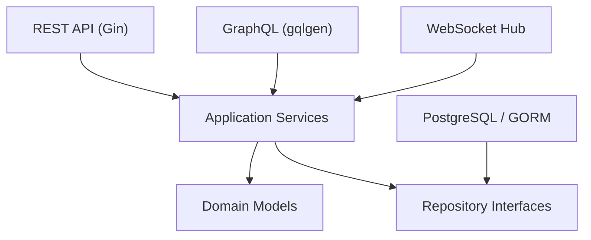

# StockWise Architecture

StockWise is a Go implementation of the original Bulgarian Inventory & Warehouse API assignment. The Bulgarian assignment remains the source of truth; this project uses Go equivalents for the required ASP.NET Core, Entity Framework Core, and SignalR technologies.

## Stack

- Go
- Gin for REST routing
- GORM for persistence
- PostgreSQL as the relational database
- Goose for migrations
- gqlgen for GraphQL
- gorilla/websocket for real-time notifications
- Go `testing` package and Testcontainers for tests

## Layers

```text
cmd/api                         API executable
cmd/migrate                     Migration command
cmd/seed                        Demo data seed command
internal/domain                 Domain models and business concepts
internal/application            Service interfaces and business use cases
internal/infrastructure         Database and external adapter implementations
internal/transport/httpapi      REST API routes, DTOs, handlers, and middleware
internal/transport/graphql      GraphQL schema and resolvers
internal/transport/websocket    Real-time notification hub
internal/common                 Shared errors and helpers
internal/config                 Runtime configuration
internal/testutil               Test helpers
migrations                      SQL migrations
docs                            Architecture and API documentation
tests/unit                      Unit tests
tests/integration               Integration tests
```

## Dependency Direction

The API transports call application services. Application services own business rules and depend on repository interfaces. Infrastructure packages implement those interfaces with PostgreSQL and GORM. Domain types do not depend on transport or persistence packages.



## Database Foundation

The PostgreSQL schema is documented in [database.md](database.md). Goose migrations live in `migrations`, and seed data is applied by `cmd/seed`.

The first migration creates the required entities, foreign keys, indexes, and database-level constraints for unique SKUs, unique warehouse codes, unique stock rows per warehouse/product pair, positive operation quantities, and non-negative supply prices.

## Implementation Status

StockWise now contains the complete assignment backend surface:

- domain models and operation statuses
- PostgreSQL schema migrations and seed data
- GORM repositories with transaction support
- service-layer business workflows
- REST API handlers and Swagger/OpenAPI documentation
- gqlgen GraphQL queries and mutations
- gorilla/websocket real-time notifications
- service-level unit tests
- Testcontainers PostgreSQL integration tests for REST, GraphQL, and WebSocket flows
