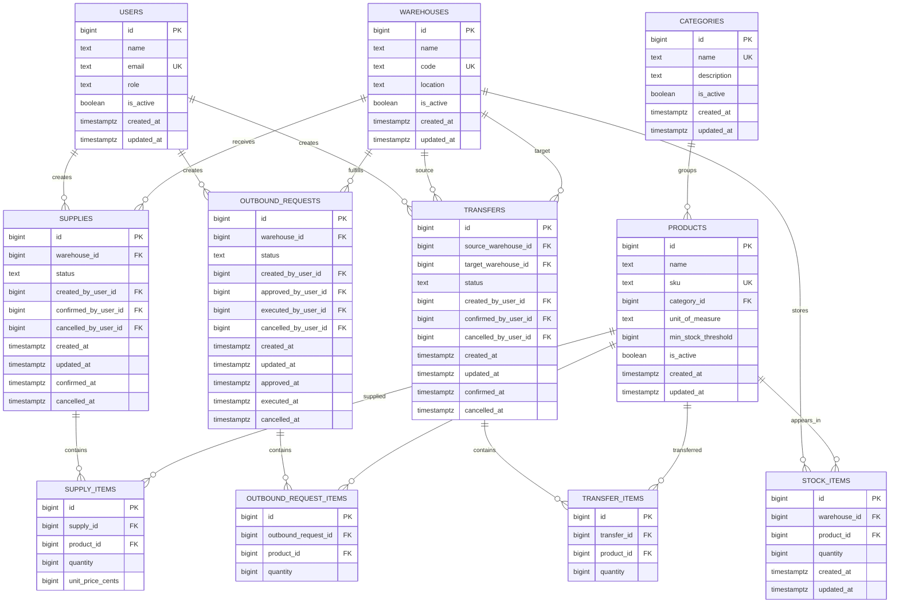

# StockWise Database Design

The database is PostgreSQL and is versioned through Goose SQL migrations. The schema mirrors the required Bulgarian assignment entities and keeps business-critical invariants close to the data where possible.

## ER Diagram



## Required Constraints

- `products.sku` is unique.
- `warehouses.code` is unique.
- `stock_items(warehouse_id, product_id)` is unique, so each product has one stock row per warehouse.
- `stock_items.quantity` cannot be negative.
- `supply_items.quantity`, `outbound_request_items.quantity`, and `transfer_items.quantity` must be positive.
- `supply_items.unit_price_cents` cannot be negative.
- `products.min_stock_threshold` cannot be negative.
- `transfers.source_warehouse_id` and `transfers.target_warehouse_id` must be different.
- Operation statuses are limited to the domain-supported lifecycle values.

## Deletion Behavior

The schema uses restrictive foreign keys for products, warehouses, and categories. This supports the assignment rules:

- Products that participate in movements cannot be hard-deleted because operation item rows reference them.
- Warehouses with stock or operations cannot be hard-deleted because stock and operation rows reference them.
- Categories with products cannot be hard-deleted. Service logic additionally blocks deletion while active products remain.
- Products with confirmed movements are soft-deactivated by the product service instead of being hard-deleted.
- Categories with inactive products can be deactivated by service logic when hard deletion would break references.

## Seed Data

The seed command is idempotent. It uses natural keys such as user email, warehouse code, category name, and product SKU with `ON CONFLICT` upserts.

Run after migrations:

```bash
go run ./cmd/seed
```
